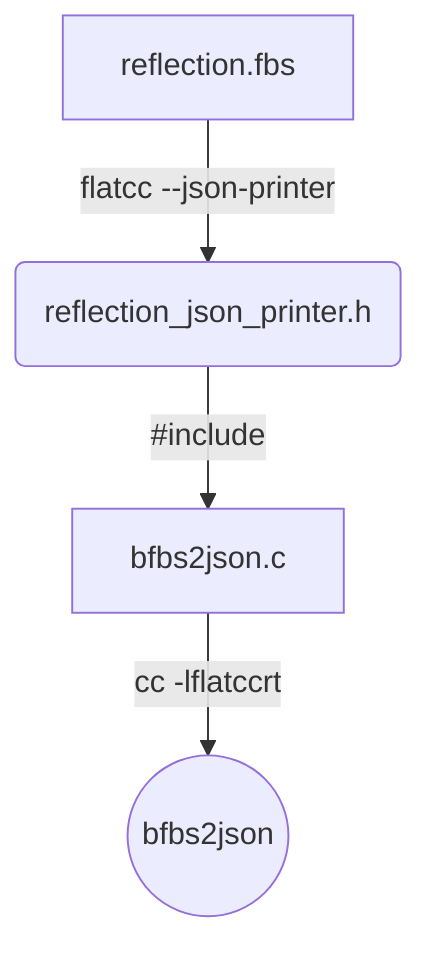
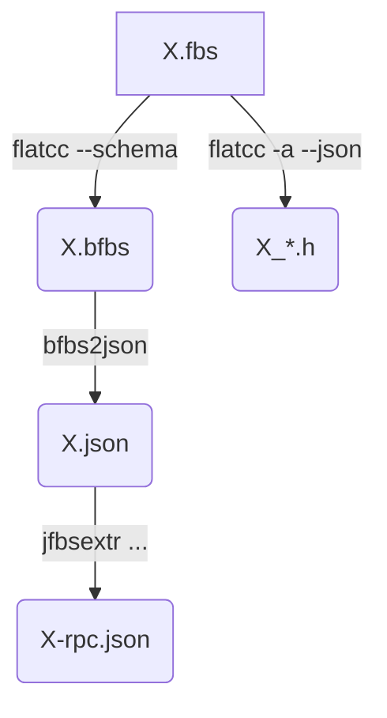
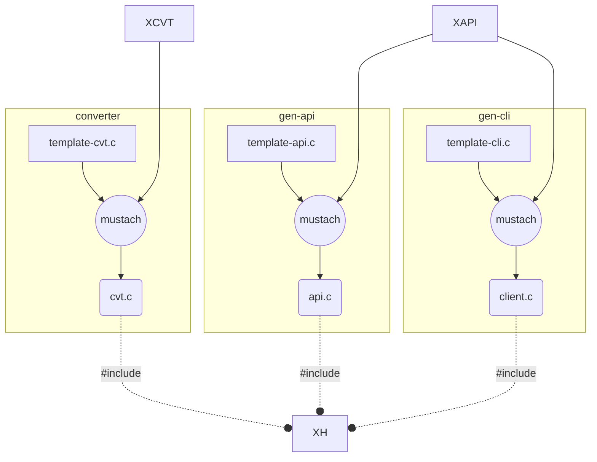

# DIRECTORY BFBS

(BFBS stands for Binary Flat Buffer Schema)

This directory contains programs used to convert a FBS (flatbuffer schema)
in codes for bindings.

It uses `flatcc` from [flatcc github](https://github.com/dvidelabs/flatcc).
But be carefull, the version used here is the version 0.6.1-pre that includes
the fixes of issues #181 and #182.

It also uses `mustach` from [mustach gitlab](https://gitlab.com/jobol/mustach).

## generate code

Code is generated from JSON inputs defining types and RPC calls.

Here an example of JSON file defining types:

```json
{
  "types": [
    {
      "typename": "get_in"
    },
    {
      "typename": "get_out"
    },
    {
      "typename": "set_in"
    },
    {
      "typename": "set_out"
    },
    {
      "typename": "tes"
    }
  ]
}
```

Here an example of JSON file defining RPC alls API:

```json
{
  "apis": [
    {
      "apiname": "sample",
      "verbs": [
        {
          "verbname": "set",
          "request": "set_in",
          "response": "set_out"
        },
        {
          "verbname": "get",
          "request": "get_in",
          "response": "get_out"
        },
        {
          "verbname": "gset",
          "request": "set_in",
          "response": "tes"
        }
      ]
    }
  ]
}
```

The code is generated using mustach templates applied to these
JSON definitions. This is achieved by the tiny script `fbgen.sh`
(TO BE DOCUMENTED)

The file `Makefile` describes the implemented process.


## generate code from schema

It can be useful to generate code automaticaly based on some schema definition.
To achieve it, the tool `bfbs2json` can be used. It takes a
**binary flatbuffer schema** at its input and produce its JSON representation.

Here is the flowchart of producing `bfbs2json`.



The below flow chart shows the process of generating type and api files based on
flatbuffers schemea using `flatcc` and `bfbs2json`.



The Makefile can be used to create these items:

```sh
$ make X-rpc-types.json X-rpc-apis.json
```


# GARBAGE



